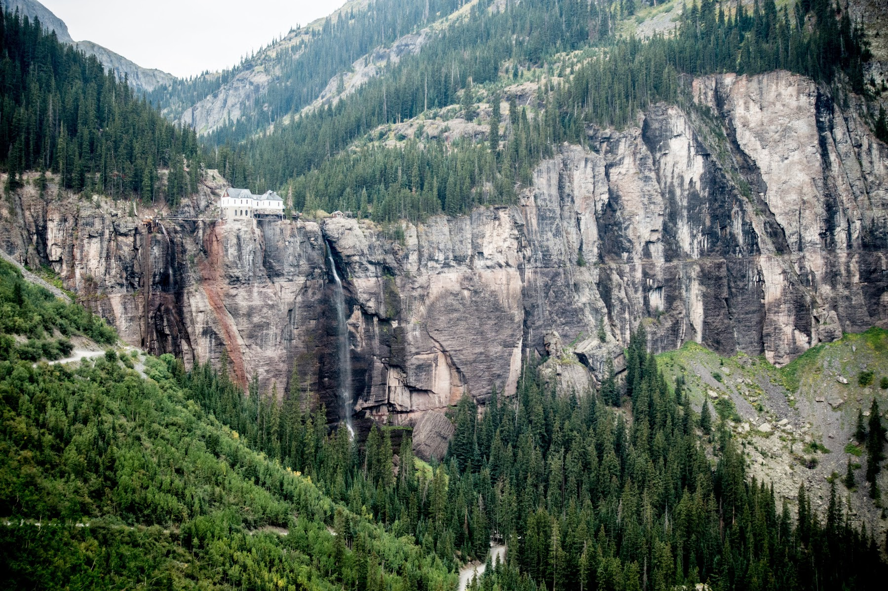

 Rocky Mountain National Park, October 2020. Dozens of elk gather among the alpine meadows as the sun casts dramatic rays through wildfire smoke.

<h2 align="center"> Howdy! Welcome to my GitHub </h2>

<h4 align="center"> 🔭 Aspiring Software Engineer 💻 🏔️ Mountain Sports Enthusiast 🤙 🦸‍♀️ Husband and Dad 👶 </h4>

<h3> Certifications </h3>
<table style="width:100%">
  <tr>
    <th>Microsoft</th>
    <td><a href="https://www.youracclaim.com/badges/a4b6d7b8-3c5a-4290-8a6f-a567423bca10/public_url">Azure Fundamentals</a></td>
    <td><a href="https://www.youracclaim.com/badges/6c9ab878-4474-478e-91e8-e6403382e2dc/public_url">Software Development Fundamentals</a></td>
  </tr>
</table>

<h3> Proficiencies </h3>
<table style="width:100%">
  <tr>
    <th>Languages</th>
    <td>C#</td>
    <td>C++</td>
    <td>Java</td>
    <td>SQL</td>
    <td>HTML/CSS</td>
    <td>Javascript</td>
  </tr>
  <tr>
    <th>Tools</th>
    <td>Azure</td>
    <td>Visual Studio</td>
    <td>Eclipse</td>
    <td>MSSQL Server</td>
    <td>Arduino IDE</td>
    <td>Matlab</td>
    
  </tr>
</table>

 Check out my <a href="https://farawayfound.com" target="_blank">website</a> I made with HTML/CSS/Javascript 

 and my <a href="https://davidchui.work" target="_blank">resume</a> I made on Wordpress 

<!--
**farawayfound/farawayfound** is a ✨ _special_ ✨ repository because its `README.md` (this file) appears on your GitHub profile.

Here are some ideas to get you started:

- 🔭 I’m currently working on ...
- 🌱 I’m currently learning ...
- 👯 I’m looking to collaborate on ...
- 🤔 I’m looking for help with ...
- 💬 Ask me about ...
- 📫 How to reach me: ...
- 😄 Pronouns: ...
- ⚡ Fun fact: ...
-->
