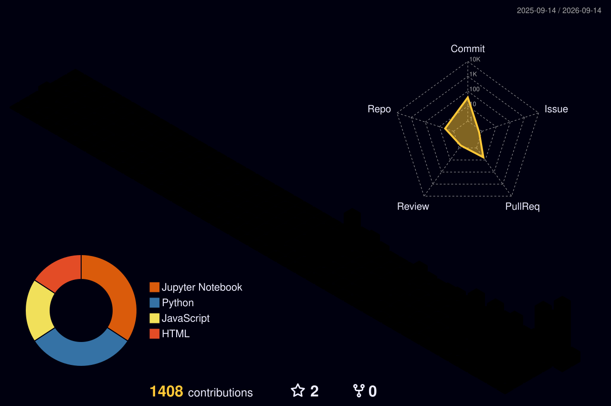

<sup>Telluride, Colorado — Via Ferrata on a summer afternoon. Some of the best views of my life.</sup>

<h2 align="center">Howdy! Welcome to my GitHub 👋</h2>
<h4 align="center">🛠️ Tenacious Software Engineer · 🤖 AI & DevOps · 🖥️ Self-Hosts Entirely Too Much · 🏔️ Mountain Sports Enthusiast · 🧑‍👩‍👦 Husband & Dad</h4>

<p align="center">
  <a href="https://davidchui.work/resume"><b>Interactive Résumé</b></a> ·
  <a href="https://davidchui.work/fleet/tour">Fleet Tour</a> ·
  <a href="mailto:david.chui@outlook.com">Email</a> ·
  <a href="https://www.linkedin.com/in/david-chui-co">LinkedIn</a> ·
  <a href="https://github.com/farawayfound">GitHub</a>
</p>

<p align="center">
  <a href="https://davidchui.work/fleet">
    <picture>
      <source media="(prefers-color-scheme: light)" srcset="https://davidchui.work/api/fleet/badge.svg?theme=light">
      <source media="(prefers-color-scheme: dark)" srcset="https://davidchui.work/api/fleet/badge.svg?theme=dark">
      
    </picture>
  </a>
</p>
<p align="center"><sup><i>That card isn't a screenshot. It's rendered on request by the fleet it describes — if the bars are grey, my machines are asleep.</i> 😴</sup></p>

---

## ✨ About Me
I stabilize and scale mission-critical systems, then make them faster, safer, and easier to ship. For four years that meant **C#/.NET + Azure** healthcare platforms at 99.9% uptime. These days it means **AI systems that actually run in production** — agentic triage assistants, local LLM runtimes, MCP servers, and the CI/CD underneath them.

Somewhere along the way, "I should self-host one model" became a **14-machine inference fleet** in my house. I regret nothing. 🔥

- **Current role:** DevOps Engineer IV @ **Spectrum (Charter Communications)**, Oct 2025 – Present  
  <sub>Video Platform Operations — building deployable AI tools, agentic triage, and the infrastructure under them.</sub>
- **Prior:** Technical Engineer II @ **HomeCare HomeBase (Hearst Health)**, 2022–2025 · Software Engineer @ **Convercent by OneTrust**, 2021–2022 · **US Air Force** (Structural Engineer), 2017–2021 · Co-Founder & Chief Engineer @ **Krate Technologies**, 2014–2016  
- **Education:** **B.S. Finance & Information Systems** — University of Colorado Denver, 2025 · *3.8 GPA, Magna Cum Laude*  
- **Hosting:** every live link on this page runs on hardware I own, behind a Cloudflare Tunnel, for the price of electricity ⚡

---

## 🛰️ What I've Been Building

### 🚗💨 [open-fleet](https://github.com/farawayfound/open-fleet) — *round up your spare machines into one private fleet of LLMs*
The open-source release of the fleet in that card. Point it at whatever hardware you already own — a gaming desktop, a Mac laptop, a decade-old tower with no GPU at all — and it detects the OS, package manager, GPU backend and VRAM, provisions the right engine for that box, and puts them all behind **one OpenAI-compatible, keyed, metered API**.

The part I'm proudest of is **honest capacity**. Context windows aren't a slider that lies: each box computes the window it can *actually* launch a given model with, from the model's real GGUF geometry against that box's measured VRAM. So a request is routed to a machine that can hold it — or told plainly that nothing can.

```
                        ┌──────────────────────────────┐
                        │     api.farawayfound.com     │     one URL.
                        │   the hub — no GPU of its    │     one key.
                        │       own, on purpose        │     fourteen machines.
                        └───────────────┬──────────────┘
      ┌───────────┬───────────┬─────────┴─┬───────────┬───────────┬────────────┐
      ▼           ▼           ▼           ▼           ▼           ▼            ▼
  Ryzen AI     2× RTX      Z13 395     M1 Max      RX 6700S    Apple M1    ..& 7 more
  Max+ 395      3090      96 GB carve   64 GB       8 GB VRAM    16 GB      CPU-only
  96 GB VRAM  48 GB VRAM   (Vulkan)    (Metal)      (Vulkan)     (Metal)    boxes, Pis,
   llama.cpp    (CUDA)                                                    a dual-booter
```

<sub>Machines are listed by silicon, not by hostname — the public API anonymizes them to <code>Box 1…Box 13</code>, and this diagram keeps that promise.</sub>

### 🎯 career-ops — *an AI job-search pipeline that runs on my own hardware*
Evaluate a posting, tailor the CV, render the ATS-safe PDF, draft the cover letter, track every application, and let a local-inference autopilot package the whole thing for review. Zero-token portal scanning across Greenhouse / Ashby / Lever / Workday, a browser companion that fills forms in your own browser, funnel analytics, and a **7,900+ check** test suite keeping me honest.

One rule, enforced in the codebase rather than in the docs: **it never submits anything.** It evaluates and recommends; a human decides and clicks. Public fork → [careerclaw](https://github.com/farawayfound/careerclaw).

### 🥔 ChunkyLink — *retrieval without the vector database*
A non-vectorized inference framework: files are indexed into cross-referenced JSON chunks so structured data can be searched *directly* for model context, instead of hoping an embedding lands nearby. It serves [davidchui.work](https://davidchui.work) — the site, the admin dashboard, that live fleet card, and the résumé you're one click from.

---

## 📈 2026, by the numbers

<!-- SHIPPED:START -->
<!-- Regenerated nightly by .github/workflows/shipped.yml — do not edit by hand. -->
**Shipped this week —** 197 contributions: [open-fleet](https://github.com/farawayfound/open-fleet) ×8 · [farawayfound](https://github.com/farawayfound/farawayfound) ×1 · **188** in private repos.
<!-- SHIPPED:END -->

|  | 2025 | 2026 *(through August)* |
|---|---:|---:|
| **Contributions** | 36 | **807** |
| **Repos touched** | 2 | **15** |

Roughly **22× the previous year** — mostly nights, weekends, and the occasional "I'll just fix one small thing" at 1am. 🌙

<picture>
  <source media="(prefers-color-scheme: dark)" srcset="https://raw.githubusercontent.com/farawayfound/farawayfound/output/snake-dark.svg">
  <source media="(prefers-color-scheme: light)" srcset="https://raw.githubusercontent.com/farawayfound/farawayfound/output/snake-light.svg">
  
</picture>

<details>
<summary>📊 <b>More graphs than any reasonable person needs</b></summary>
<br>



</details>

> Full disclosure: I also hold a **YOLO** achievement badge for merging a pull request without review. I'd love to say it was a deliberate statement about shipping velocity. It was not.

---

## 🧰 Tech I Use
**Languages:** C#, Python, Java, T-SQL, PowerShell, Bash, JavaScript/TypeScript, HTML/CSS  
**Cloud & DevOps:** **AWS**, **Azure** (App Services, Functions, Container Apps/Registry, API Mgmt), Terraform, **Kubernetes**, Docker, Rancher, GitLab CI/CD, Azure DevOps, GitHub Actions, Cloudflare Tunnel  
**AI & Inference:** Claude Code, **MCP** (Model Context Protocol), llama.cpp, Ollama, PyTorch, RAG & structured indexing, local model serving  
**Data & Ops:** SSMS, MongoDB, Kafka, Splunk, ServiceNow, Jira, Postman, JAMS, Linux  
**Strengths:** Incident management, root-cause analysis, performance tuning, data operations, documentation & enablement

---

## 🏅 Certifications & Schooling
- **Microsoft Azure Developer Associate (AZ-204)** — 2024  
- **Microsoft Azure Data Fundamentals (DP-900)** — 2023  
- **Oracle OCP: Java SE 11 Developer** — 2021  
- **Microsoft Azure Fundamentals (AZ-900)** — 2021  
- **MTA: Software Development Fundamentals** — 2020  
- **Cloud Application Developer** — Embry-Riddle / Microsoft Software & Systems Academy, 2021  
- **A.S. Construction Management** — Community College of the Air Force, 2020

> Verification links available on request, or through my [interactive résumé](https://davidchui.work/resume).

---

## 📌 Highlights
- **AI in production:** Architected a low-cost local LLM runtime that cut token use from hundreds of thousands per response to configurable limits — giving internal teams secure, relevant, and *economical* AI context.  
- **Agentic triage:** Built MCP servers and an agent orchestrator that ingest the shared knowledge base through OCR + NLP classification, then self-learn — promoting discovered facts into version-controlled, editable chunks.  
- **Reliability:** Sustained **99.9% uptime** on a healthcare platform — Kubernetes clusters, load-balanced nodes, and Kafka pods wrangled during major incidents, with blameless postmortems after.  
- **Automation:** A Java + ServiceNow + Python compliance-reporting pipeline that saved **500+ labor hours a year**.  
- **Delivery:** **30+ billable customer projects** end-to-end, **600+** high-priority requests resolved, and **300+** tickets at a **98% acceptance rate**.  
- **Scale:** A localization framework that opened 3 new languages to **400k+** international users.  
- **Enablement:** Mentored engineering teams on agentic development and AI coding standards, and presented from proposal through MVP to implementation for Directors and the VP of Video Product Operations.

---

## 🏔️ Off the Keyboard
Mile-high resident, Air Force veteran, husband and dad. If the commit graph goes quiet for a weekend, I'm on a via ferrata, a bike, or a mountain somewhere — probably the one at the top of this page. 🚵

<p align="center">
  <i>Got an interesting problem, a pile of idle machines, or a strong opinion about self-hosting?</i><br>
  <a href="mailto:david.chui@outlook.com"><b>Let's create something amazing.</b></a>
</p>
